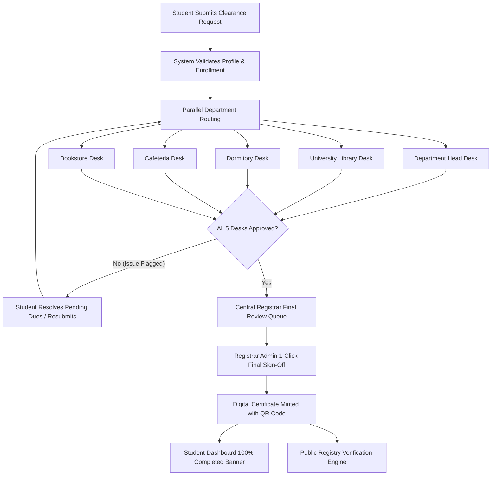

# Madda Walabu University (MWU) e-Clearance & Digital Certification System

[](https://react.dev/)
[](https://nodejs.org/)
[](https://www.mongodb.com/)
[](https://tailwindcss.com/)
[](LICENSE)

An enterprise-grade, paperless university clearance management system and digital certification platform engineered for **Madda Walabu University (MWU)**. Replaces traditional multi-week paper signature runs with a cryptographic, multi-desk digital clearance pipeline and instant QR-verifiable academic certificates.

---

## Key Features & Capabilities

### 1. Multi-Desk Automated Clearance Engine
- **Sequential & Parallel Department Checkpoints**:
  1. **Academic Department Head**: Final thesis/project verification and laboratory equipment return.
  2. **University Library**: Library card surrender and book return clearance.
  3. **Student Dormitory**: Key handover and dormitory inventory audit.
  4. **Dining & Cafeteria**: Meal coupon reconciliation and non-cafe dues clearance.
  5. **University Bookstore**: Textbook return verification.
  6. **Central Registrar Desk**: Academic grade audit, transcript release, and final certificate issuance.
- **Dynamic State Machine**: Tracks status transitions across `pending` -> `in_progress` -> `approved` -> `completed` / `rejected` with custom remarks and real-time rejection resolution.

### 2. QR-Verifiable Digital Certificate & Public Registry
- Instant generation of tamper-evident clearance certificates upon Registrar sign-off.
- **Public Verification Portal (`/verify`)**: Employers, embassies, and universities can verify clearance authenticity in real time by scanning the certificate QR code or searching by:
  - **Certificate Number** (e.g., `MWU-CLR-2026-8304`)
  - **Student ID** (e.g., `Ugr/50002/15`)
  - **Student Name** or **Clearance Request Number**
- Cryptographic SHA-256 digital stamp for non-repudiation.

### 3. Role-Based Portals & Dashboards
- **Student Portal**: Start clearance with auto-populated academic info, real-time checklist progress (0% - 100%), document vault, in-app messaging with specific desk officers, and 1-click certificate download.
- **Department Officer Desk**: Filterable queues for pending, approved, and rejected requests with checklist item validation, student identity preview, and batch processing.
- **Central Registrar Command Center**:
  - **Student Account Verification Center**: Verify new student registrations and identity records.
  - **Clearance Oversight & Pending Queue**: Monitor all active university clearances.
  - **1-Click Final Sign-Off & Certificate Minting**: Final approval that seals the digital certificate and notifies the student.
  - **University Directory & Department Management**: Manage official MWU faculties, departments, and officer credentials.
  - **Audit Logs & Analytics**: Complete activity trail with timestamps, IP tracking, and processing time KPIs.

---

## System Architecture & Workflow



---

## Live Demo Accounts & Credentials

To explore and test the system locally or in production:

| Portal Role | Email / Identifier | Password | Access Level |
|---|---|---|---|
| **Central Registrar Admin** | `registrar@mwu.edu.et` | `Admin@12345` | Full System Admin, Verification & Final Approvals |
| **Department Head (CS)** | `cs_head@mwu.edu.et` | `Officer@12345` | Department Head Review Desk |
| **Library Officer** | `library@mwu.edu.et` | `Officer@12345` | Library Clearance Desk |
| **Dormitory Officer** | `dormitory@mwu.edu.et` | `Officer@12345` | Dormitory Clearance Desk |
| **Cafeteria Officer** | `cafeteria@mwu.edu.et` | `Officer@12345` | Cafeteria Clearance Desk |
| **Bookstore Officer** | `bookstore@mwu.edu.et` | `Officer@12345` | Bookstore Clearance Desk |
| **Graduating Student** | `student@mwu.edu.et` (or `UGR/1234/12`) | `Student@12345` | Student Clearance Tracking & Certificate Download |

**Sample Public Verifiable Certificate Records in Database**:
- Student ID: `Ugr/50002/15` | Cert Serial: `MWU-CLR-2026-8304` | Student: *Abdisa Tahir*
- Student ID: `Ugr/51234/15` | Cert Serial: `MWU-CLR-2026-5561` | Student: *Bayya Awel*

---

## Tech Stack & Tooling

### Frontend
- **Framework**: [React 18](https://react.dev/) with [TypeScript](https://www.typescriptlang.org/)
- **Build Tool**: [Vite](https://vitejs.dev/)
- **Routing**: [React Router 7](https://reactrouter.com/)
- **UI Components & Icons**: [Tailwind CSS](https://tailwindcss.com/) + [Lucide React](https://lucide.dev/)
- **Notifications & Feedback**: [Sonner](https://sonner.emilkowal.ski/)
- **Responsive Layout**: Full support for Mobile (Slide-over Drawers), Tablets, and 4K Desktops.

### Backend
- **Runtime**: [Node.js](https://nodejs.org/) (ES Modules)
- **Web Framework**: [Express.js](https://expressjs.com/)
- **Database ORM**: [Mongoose](https://mongoosejs.com/)
- **Database**: [MongoDB Atlas](https://www.mongodb.com/atlas) (Sharded Multi-Region Cluster)
- **Authentication**: Stateless JSON Web Tokens (JWT) + [bcryptjs](https://github.com/dcodeIO/bcrypt.js)
- **QR Engine**: [QRCode](https://github.com/soldair/node-qrcode) (2D Canvas/DataURI generation)
- **Email Dispatcher**: [Nodemailer](https://nodemailer.com/) (SMTP integration)

---

## REST API Overview

| Method | Route | Description | Auth Level |
|---|---|---|---|
| `POST` | `/api/auth/register` | Register new student account with official MWU faculty/department | Public |
| `POST` | `/api/auth/login` | Authenticate user via Email, Student ID, or Staff ID | Public |
| `GET` | `/api/public/verify/:query` | Search and verify clearance certificate by ID or serial | Public |
| `GET` | `/api/public/academic-structure` | Fetch official MWU colleges, faculties, and degree programs | Public |
| `GET` | `/api/clearances/my` | Retrieve student's clearance progress, checklist, and certificate | Student |
| `POST` | `/api/clearances` | Submit a new graduation or withdrawal clearance request | Student |
| `GET` | `/api/officer/dashboard` | Fetch officer desk statistics and clearance queues | Officer |
| `PUT` | `/api/officer/clearance/:id/status` | Approve or reject a department checkpoint with remarks | Officer |
| `GET` | `/api/registrar/dashboard` | Fetch university-wide clearance metrics and KPI breakdown | Registrar |
| `PUT` | `/api/registrar/users/:id/verify` | Officially verify and activate student academic profile | Registrar |
| `PUT` | `/api/registrar/clearance/:id/final-approve` | Mint official QR certificate and complete clearance | Registrar |

---

## Local Development Setup

### 1. Clone Repository
```bash
git clone https://github.com/your-username/mwu-clearance-system.git
cd mwu-clearance-system
```

### 2. Backend Setup
```bash
cd backend
npm install
npm run dev
```
*Backend server runs on `http://localhost:5000` with MongoDB Atlas connected.*

### 3. Frontend Setup
```bash
cd ../frontend
npm install
npm run dev
```
*Frontend application runs on `http://localhost:5173`.*

---

## Author & Contact
- **Institution**: Madda Walabu University (MWU), Ethiopia
- **Project**: University Clearance & Certification Management System
- **License**: MIT
